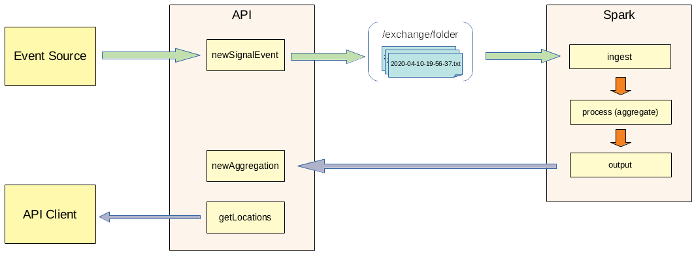

# shimanami-kaido
Streaming data analysis.
This repository cantains a Spark client/job and an API that ingests data into it and outputs results to its users.
The application code can be used for education purpose.

## Business Case
Suppose that there are certain signals or events that come from some source system. The task is to do some aggregation on the fly and keep current results available for users to view.
Signal schema:

```
{
  "id_sample": "95ggm", 	// item identifier
  "num_id": "fcc#wr995", 	// item serial number
  "id_location": "1564.9956", 	// location id, can be a name
  "id_signal_par": "0xvckkep",	// sensor generating signal
  "id_detected": "None", 	// status data (None), - functional, (Nan), - failed
  "id_class_det": "req44"	// failure type
}
```

The task is to find current number of both functional and failed (`id_detected`) signals per location (`id_location`).


## Components
There are 3 components (applications) in this repository:
1. [sparkclient](https://github.com/oleglukin/shimanami-kaido/tree/master/java/sparkclient)
2. [api](https://github.com/oleglukin/shimanami-kaido/tree/master/java/api)
3. [eventsource](https://github.com/oleglukin/shimanami-kaido/tree/master/java/eventsource)





### 1. Sparkclient
This application contains Spark driver program and events stream processing logic (aggregation). It has been tested in local mode only.
It ingests data from a local folder (configurable within the properties file). The folder is monitored for new files and the new files are ingested as a stream.
This data should have a schema matching signal event to be parsed (see data model below).
Parsed data is then grouped by `id_location` and `id_detected` to find count of functional and failed events for each location.
Once grouped the data is being sent to HTTP endpoint (see API methods below).

### 2. API
Methods:
- `newSignalEvent` - accept new signal event and process it: accumulate events into batches and then dump into a file
- `get` - get aggregation results by location
- `getLocations` - get aggregations for all known locations
- `newAggregation` - accept new aggregation, add/update in memory to make it available for API users

There is a class called `SignalHandler`. It's purpose is to accumulate new signals from controller and dump them to a text file once in a while.

### 3. EventSource
This is only for testing. Create a number of random events and send them to APIs HTTP endpoint.


## Things to Improve / Consider Changing
- Ingest evens through TCP socket connection or use Kafka. Currently it reads events from  files in a folder
- Probably would be better to output aggregation results using Kafka or other queue
- Test and make sure that sparkclient can work with Spark cluster (standalone or YARN/Mesos)
